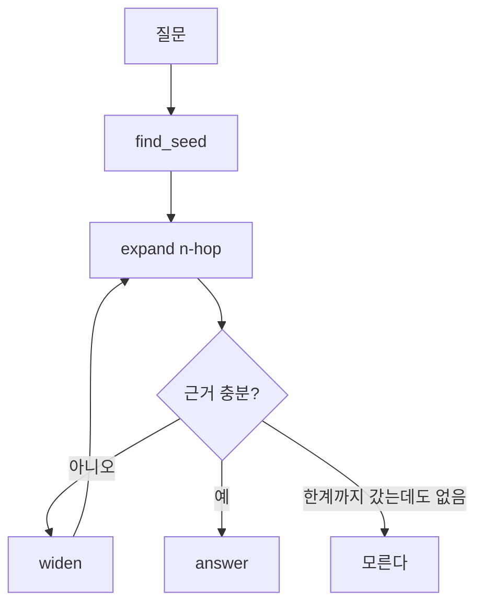

# REPORT — 지식 그래프 에이전트

> 작성 가이드의 6개 절을 그대로 둔다. 개발이 끝나는 대로 각 절을 채운다.

## 1. 주제와 코퍼스
- 어떤 주제를 왜 골랐는가
- 데이터셋 몇 건을 어떻게 모았는가 (채택/탈락 기준 포함)

## 2. 골든셋과 스키마
- 홉 수별 문항 수
- 기대 경로를 정한 기준
- 뽑지 않기로 한 관계와 그 대가

## 3. 측정 결과
- 홉 수별 basic RAG 대조표
- 경로 재현율
- 실패의 층 분류 (색인 · 탐색 · 생성)

## 4. 파이프라인 구조도
LangGraph 노드 및 State 흐름 (Mermaid)

## 5. 데모 설계
- 화면을 구성하면서 신경 쓴 부분
- 화면 캡처

## 6. 프로젝트 회고
- 가장 공들인 부분
- 향후 보완하고 싶은 개선점
