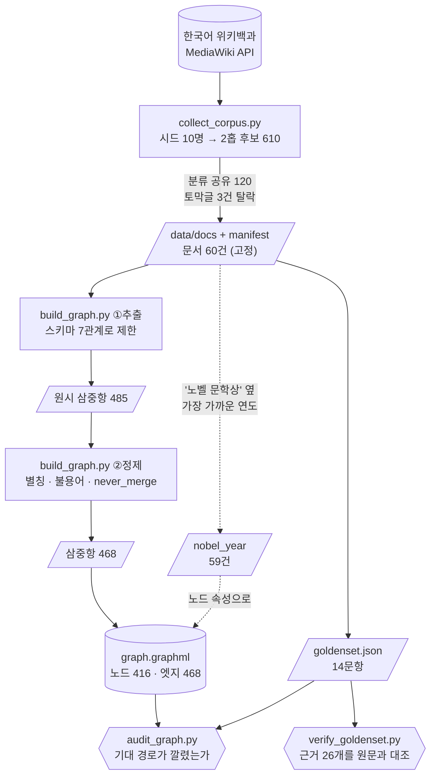
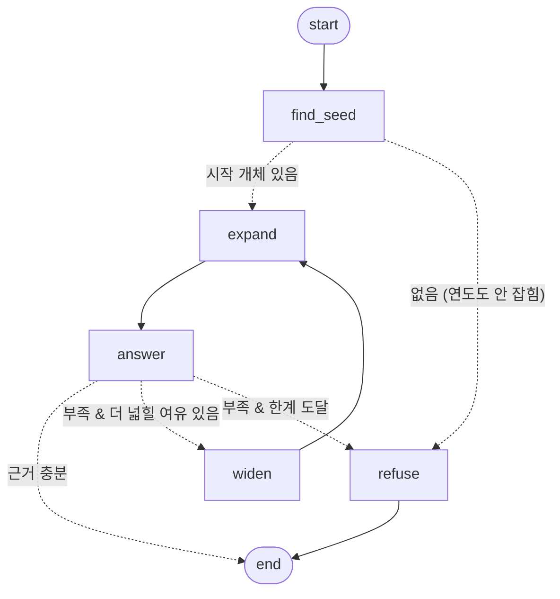
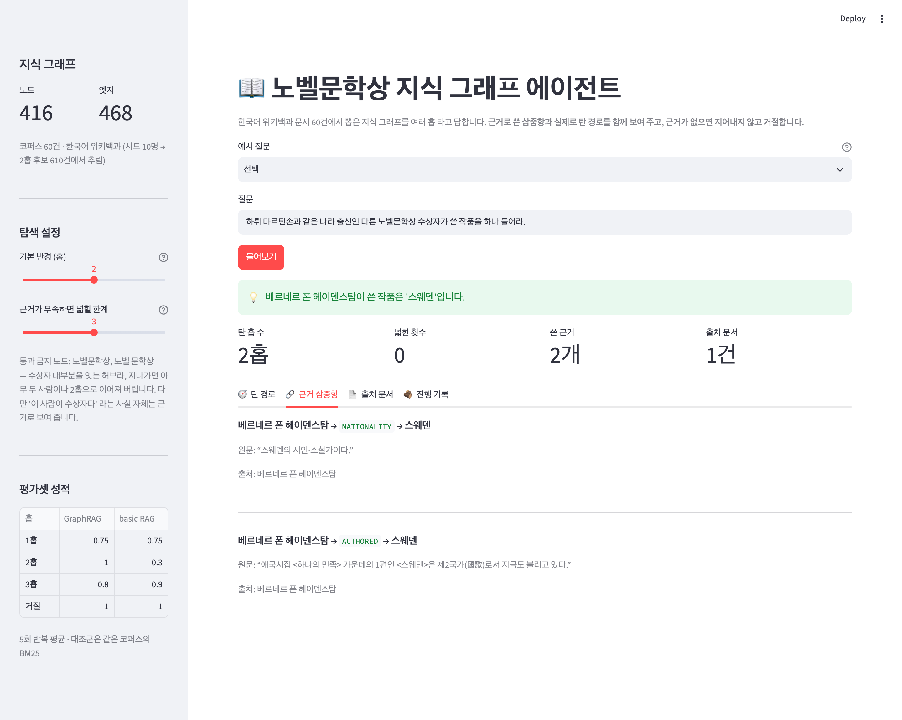
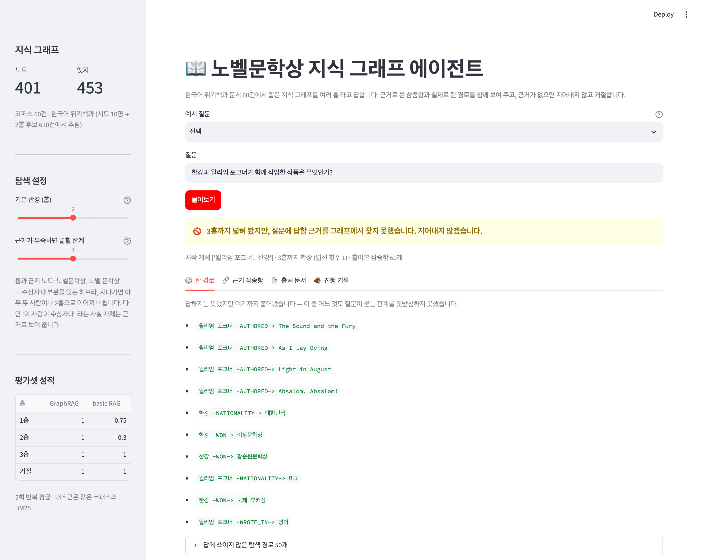
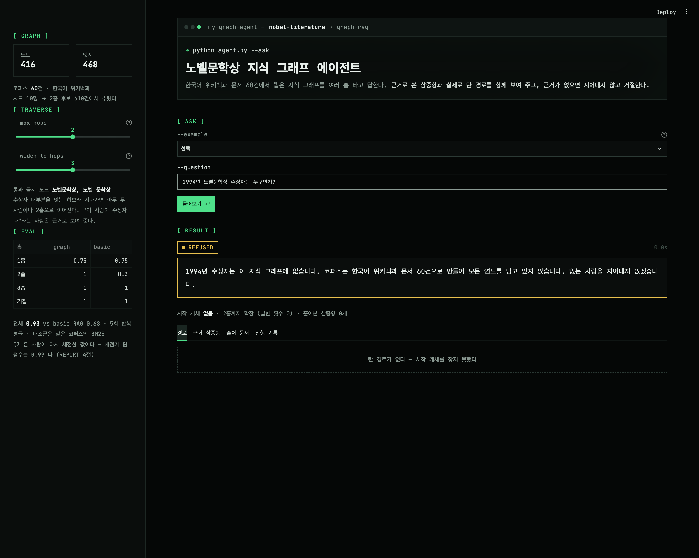

# 노벨문학상 지식 넓히기 - 지식 그래프 에이전트 보고서

> 한국어 위키백과 문서 60건 → 지식 그래프(노드 416 · 엣지 468) → LangGraph 멀티홉 에이전트
> 평가셋 14문항 5회 반복: **GraphRAG 0.90 vs basic RAG(BM25) 0.66**
>
> 이 문서의 모든 숫자는 `output/` 의 산출물에서 그대로 옮긴 것이다.
> `e2e_run.json` · `eval.json` · `eval_hop1~3.json` · `eval_hop2widen3.json` ·
> `eval_q3-stability.json` · `build_report.json` · `index_audit.json` · `data/manifest.json`

---

## 0. 전 구간 구동 확인

문서 수집부터 답변 생성까지 **한 번에 이어서 돌려 오류 없이 끝나는지**를 매번 확인한다. 아래는 마지막 실행 기록이며 `output/e2e_run.json` 에 그대로 남아 있다 (`python run_e2e.py` 로 재현).

| 단계 | 명령 | 소요 | 결과 |
|---|---|---|---|
| ① 코퍼스 수집 | `collect_corpus.py` | 0.1초 | ✅ |
| ② 평가셋 자체검사 | `verify_goldenset.py` | 0.2초 | ✅ |
| ③ 그래프 구축 | `build_graph.py` | 0.4초 | ✅ |
| ③' 색인 점검 | `audit_graph.py` | 0.1초 | ✅ |
| ④ 답변 생성 | `agent.py "…"` | 2.2초 | ✅ |
| ⑤ 채점 + 대조군 | `evaluate.py --repeat 1 --tag smoke` | 29.7초 | ✅ |
| ⑥ 데모 적재 | `import app` | 0.2초 | ✅ |
| | | **32.9초** | **전 구간 무오류** |

두 번째 실행부터 ①③이 0.1초대인 것은 **멱등하게 만들었기 때문이다.** 처음 모을 때는 ①이 4분 가까이 걸린다 (위키백과 API 예절 — 호출 사이 0.6초, 429 면 `Retry-After` 만큼 더).

**여기서 실제로 데인 적이 있다.** 예전 `collect_corpus.py` 는 "파일이 있으면 건너뛴다"로만 막았는데, 위키백과는 살아 있는 소스라 돌릴 때마다 후보 순서가 달라진다. 그래서 재실행할 때마다 **새 문서가 더 쌓였다** — 60건이 85건이 되고 98건이 됐다. 그동안 `manifest.json` 은 그 회차에 저장한 60건만 적었고, `build_graph.py` 는 디렉토리를 통째로 glob 해서 98건을 흡수했다. **문서가 말하는 그래프와 실제 그래프가 달라진 것이다.**

두 곳을 고쳐 막았다:

- `collect_corpus.py` — manifest 에 적힌 목록이 곧 코퍼스다. 완성돼 있으면 아무것도 하지 않는다 (`--refresh` 로만 다시 모은다).
- `build_graph.py` — 디렉토리가 아니라 **manifest 의 파일 목록**만 읽는다. 디렉토리에 남은 파일이 있으면 그 사실을 알리고 무시한다.

추출 캐시 키도 `제목|본문 길이` 에서 **본문 내용 해시**로 바꿨다. 길이가 같은 다른 개정판이 옛 추출을 재사용하던 구멍이었다. 지금은 같은 문서·같은 프롬프트·같은 모델이면 캐시가 100% 적중하고 `graph.graphml` 해시가 동일하다.

---

## 1. 주제와 코퍼스

### 왜 노벨문학상 수상자인가

본 프로젝트는 도메인과 별개로 지식 그래프 에이전트 구축 경험에 초점을 두고 주제를 선정한 뒤 진행되었다.

멀티홉을 증명하려면 **개체가 문서 사이에서 겹쳐야** 한다. 한 문서만 읽어 답이 나오면 그래프가 한 일이 없다.

노벨문학상 수상자는 이 조건을 자연스럽게 만족한다. 수상자들은 서로 만난 적 없어도 **국가·언어·수상 이력을 공유**한다. "네루다와 같은 나라 출신 수상자"는 네루다 문서에도, 미스트랄 문서에도 답이 없고 두 문서를 이어야만 나온다.

동시에 **거대 허브가 구조적으로 보장된다.** 수상자 60명이 전부 `노벨 문학상` 하나에 매달린다. 허브를 어떻게 다룰지가 과제가 되는 주제를 일부러 골랐다 (→ 2절).

### 어떻게 모았는가

`collect_corpus.py` — MediaWiki API만 사용, HTML 크롤링·파싱 없음.

```
시드 10명 (한강·이시구로·토카르추크·마르케스·파무크·뮐러·레싱·베케트·포크너·네루다)
  → 시드 본문 링크(prop=links, ns=0) 중 여러 시드가 함께 가리킨 것부터   2홉 후보 610건
  → 시드와 분류(category)를 하나 이상 공유하는 것만 남김                 120건 (40건 탈락)
  → 본문 수집(prop=extracts) → 800자 미만 토막글 버림                    3건 탈락
  → 저장                                                                 60건
```

| 채택 기준 | 탈락 기준 |
|---|---|
| 시드가 본문에서 가리키고(2홉 이내) | 연도·목록·틀·분류 문서 (정규식 제외) |
| 시드와 분류를 하나 이상 공유하고 | 시드와 분류를 공유하지 않음 — 40건 |
| 본문 800자 이상 | 800자 미만 토막글 — 카를펠트(620자)·레이몬트(582자)·싱어(379자) |

본문 길이 중앙값 1,549자, 합계 207,922자. 건수와 탈락 사유는 `data/manifest.json` 에 그대로 있다.

**수집 중 부딪힌 것.** 과제가 제시한 0.3초 간격으로는 429(요청 과다)가 반복해서 났다. 0.6초로 늘리고 `Retry-After` 를 따르는 백오프를 넣었다 — 5문서마다 한 번씩 약 50초를 쉬며 돌았다. 중간에 끊겨도 이어받도록 이미 저장한 문서는 건너뛴다.

### 이 코퍼스의 한계

**전부 인물 전기문이고, 작품 단독 문서가 없다.** 그래서:

- 작품·언어·국적·수상 이력이 **전기문 안에 다 들어 있다.** 1홉 질문은 한 문서만 읽어도 풀린다. 멀티홉 증명은 전적으로 2홉 이상 문항에 달려 있다.
- 2홉을 잇는 **다리가 Award·Country 두 종류로 좁혀졌다.** 문학사조는 위키 분류 메타데이터에만 있고 본문에 없으며, "독일어로 썼다"는 60건 중 기엘레루프 1건뿐이었다.

이 제약이 그대로 2절의 스키마 선택으로 이어진다.

---

## 2. 골든셋과 스키마

### 스키마 — 관계 7종

```
AUTHORED      Laureate → Work        수상자가 그 작품을 썼다
WON           Laureate → Award       받은 문학상 (노벨문학상 포함)
NATIONALITY   Laureate → Country     국적 또는 출신국
WROTE_IN      Laureate → Language    작품 활동의 주 언어
BELONGS_TO    Laureate → Movement    속한 문학사조
HAS_GENRE     Work     → Genre       작품의 갈래
INFLUENCED_BY Laureate → Laureate    원문이 영향을 밝힌 경우만
```

노드 타입은 관계가 정한다 — `AUTHORED` 의 주어는 Laureate, 목적어는 Work. 추출 프롬프트에 스키마를 박아 넣고 "목록에 없는 관계는 만들지 않는다, 애매하면 뽑지 않는다"고 못 박았다.

### 뽑지 않기로 한 것과 그 대가

| 뽑지 않은 것 | 이유 | 대가 |
|---|---|---|
| **수상 연도를 노드로** | 같은 해 수상자가 전부 한 노드에 묶여 정보량 0인 허브가 된다 | 연도가 탐색의 **경유지**가 될 수 없다. "X와 같은 해에 받은 사람은?" 류는 지금도 못 푼다 (아래 참조) |
| **출판사·번역가 관계** | 위키 본문에 일관되게 나오지 않는다 | 출판 경로를 타는 질문 불가 |
| **`노벨 문학상` 노드 경유** | 수상자 56명을 잇는다(차수 56, 2위의 1.3배). 지나가면 아무 두 수상자나 2홉이 되어 멀티홉이 무의미해진다 | 아래 참조 — 이 결정이 한 번 역효과를 냈다 |

**허브 차단이 과했던 사례.** 처음에는 `노벨 문학상` 을 통과 금지하면서 **그 엣지까지 근거에서 뺐다.** 그러자 "맨부커상을 받은 다른 **노벨문학상 수상자**"를 물었을 때, 답할 사람들이 수상자인지 확인할 근거가 그래프 어디에도 없어 에이전트가 거절해 버렸다.

통과 금지와 존재 부정은 다르다. `X -WON-> 노벨 문학상` 은 참인 사실이고 근거로 보여줘야 한다. 막아야 할 것은 그 노드를 **디딤돌 삼아** 건너뛰는 것뿐이다. 경유(BFS 확장)만 막고 엣지는 근거에 남기도록 분리해서 해결했다.

### 연도는 노드가 아니라 속성으로 — 그리고 실제로 조회한다

연도를 노드로 만들지 않기로 한 대가를 그냥 떠안지 않고, **Laureate 노드의 `nobel_year` 속성**으로 붙였다. 본문 59/60건에서 추출돼 그래프의 Laureate 노드 55개에 달려 있다.

에이전트는 질문에서 연도를 읽으면 이 속성을 조회한다(`_year_lookup`). 연도는 그래프에 노드가 없으므로 BFS로는 절대 닿지 않는다 — 별도 경로가 필요하다.

```
"2024년 수상자는?"   → 속성 조회 → 한강             (근거: 한강 -WON_IN_YEAR-> 2024)
"1945년 수상자는?"   → 속성 조회 → 가브리엘라 미스트랄
"1994년 수상자는?"   → 연도는 읽었으나 해당 수상자가 코퍼스에 없음 → 거절
```

**연도 추출에서 두 번 틀렸다.** 처음엔 "노벨 문학상" 주변 40자 안의 아무 연도나 집었더니, `1971년에 맨부커상을, 2001년에 노벨 문학상을 받았다`에서 **1971**(부커상 연도)을 가져왔다. 나이폴과 크러스너호르커이 두 사람이 틀렸다. "노벨 문학상"이 나온 자리마다 **가장 가까운** 연도만 표로 받도록 고쳐 표본 15건 전부 일치시켰다.

**시작 개체 찾기에서도 한 번 틀렸다.** 연도가 보이면 무조건 조회했더니, `"이시구로가 1989년 맨부커상을 받은 작품은?"`에서 1989년 노벨상 수상자(카밀로 호세 셀라)가 근거에 딸려 들어왔다. **이름을 하나도 못 찾았을 때만** 연도 조회를 쓰도록 좁혔다 — 이름이 있으면 그쪽이 훨씬 확실한 시작점이다.

**남은 대가.** 연도는 여전히 탐색의 경유지가 아니다. "헤밍웨이와 같은 해에 받은 사람은?" 같은 질문은 못 푼다. 그 질문을 풀려면 연도를 노드로 만들어야 하고, 그러면 처음에 피하려던 허브가 생긴다.

### 같은 개체를 하나로 합치는 기준

표기가 흔들린 같은 개체를 하나로 모으는 규칙은 네 겹이고, **순서가 중요하다.** 앞의 것이 뒤의 것보다 강하다.

| 순서 | 기준 | 무엇을 합치나 | 실제 발동 |
|---|---|---|---|
| 1 | **문서 제목을 표준 표기로 고정** (추출 시점) | 한 문서의 주인공은 그 문서 제목으로만 적는다 | 프롬프트 지시로 해결 |
| 2 | **명시적 별칭 표** `alias_map` | 사람이 확인한 동의어 — 부커상 계열 5종, 노벨문학상/노벨 문학상 | 상시 |
| 3 | **병합 금지 쌍** `never_merge` | 합치면 **안 되는** 쌍을 4번보다 먼저 걸러낸다 | `부커상` ↔ `국제 부커상` |
| 4 | **문자열 유사도** `fuzzy_threshold 92` | 1~3으로 안 잡힌 나머지 | **0건** |

여기에 노드 자체를 버리는 규칙이 따로 있다 — 스키마 밖 관계, 일반명사 노드(`작가`·`소설`·`시인` 등 9종), 한 글자 노드.

### 왜 문자열 거리에 맡길 수 없었나

```
원시 삼중항 485 → 별칭 치환 485 → 스키마 필터 485 → 일반명사 제거 474 → 중복 합침 468
버린 것: 일반명사 노드 7 · 한 글자 노드 4
```

**핵심 함정.** 코퍼스에 부커상 계열 표기가 5종 있다.

| 표기 | 건수 | 실제로 어떤 상인가 |
|---|---|---|
| 국제 부커상 | 12 | International Booker (번역서 대상) |
| 맨부커 국제상 | 1 | ↑ **같은 상** |
| 맨부커상 | 7 | Booker Prize (영어 원작) |
| 부커상 | 4 | ↑ 같은 상 |
| 부커 상 | 1 | ↑ 같은 상 |

`국제 부커상` 과 `부커상` 은 **이름이 거의 같지만 서로 다른 상이다.** 별칭 병합에 흔히 쓰는 문자열 유사도를 그대로 걸면 반드시 합쳐진다:

| 비교 쌍 | ratio | partial_ratio | token_set_ratio |
|---|---|---|---|
| **부커상 / 국제 부커상** | 67 | **100** | **100** |
| 가브리엘라 미스트랄 / 프레데리크 미스트랄 | 60 | 71 | 60 |
| 윌리엄 골딩 / 윌리엄 포크너 | 62 | 80 | 67 |

partial·token_set 기준 **100점**이다. 합쳐졌다면 평가셋 4번(한강→먼로·토카르추크)과 6번(이시구로→나이폴·고디머·골딩)의 정답이 통째로 뒤섞였을 것이다. 그래서 `config.json` 에 `never_merge` 쌍을 두어 fuzzy 병합 **전에** 걸러낸다.

**예상과 달랐던 것: fuzzy 병합이 0건 발동했다.** 표기 흔들림을 앞단이 모두 잡았기 때문이다 — 명시적 `alias_map` 과, 추출 프롬프트에 박은 "문서 제목을 그 인물의 표준 표기로 쓰라"는 지시다.

후자는 실제로 고친 문제다. 처음 추출했을 때 `V. S. 나이폴` 이 본문 첫 문장의 `비디아다르 수라지프라사드 나이폴` 로 들어가 평가셋과 어긋났다. 문서 제목을 표준 표기로 고정하니 해결됐고, LLM이 놓칠 때를 대비한 안전망(성씨 공유 + partial_ratio)도 넣었으나 **실제 발동 0건** — 프롬프트만으로 충분했다.

결론: 이 코퍼스에서 표기 통일을 해낸 것은 문자열 거리가 아니라 **추출 시점의 제약**과 **손으로 쓴 별칭 표**였다. 임계값을 낮췄다면 미스트랄 두 사람(71점)이 합쳐졌을 것이다.

### 골든셋 — 14문항

| 홉 | 문항 수 | 다리(브릿지) |
|---|---|---|
| 1홉 | 4 | — (1건은 연도 속성 조회) |
| 2홉 | 5 | 국제 부커상 · 칠레 · 부커상 · 덴마크 · 이탈리아 |
| 3홉 | 2 | 국제 부커상 · 스웨덴 |
| **거절** | **3** | 근거가 없어 "모른다"고 해야 정답인 문항 |

문항마다 기대 정답 · 기대 경로(관계를 순서·방향까지) · **원문 근거 문장**을 적었다. 근거는 그래프가 아니라 `data/docs` 의 원문에서 직접 확인했다 — 그래프에서 도출하면 순환 논리가 된다.

**기대 경로를 정한 기준.** 사람이 그 질문에 답하려면 최소한 어떤 사실들을 연결해야 하는가를 먼저 적고, 그것을 관계 이름으로 옮겼다. 예를 들어 5번은 `네루다 -NATIONALITY-> 칠레`, `칠레 -~NATIONALITY-> 미스트랄` 두 걸음이다(`~` 는 역방향). 그래프를 보고 거꾸로 맞춘 경로가 아니다.

**평가셋을 기계로 검사한다.** `verify_goldenset.py` 가 매번 확인하는 것:

1. 근거 문장 26개가 해당 원문 파일에 **글자 그대로** 있는가
2. 2홉 이상 문항의 근거가 **문서 2건 이상**에 걸쳐 있는가 — 한 문서로 답이 나오면 멀티홉이 아니므로 실패 처리
3. 거절 문항의 핵심어가 코퍼스에 정말 없는가 — "무라카미"가 60건 어디에도 없음을 확인
4. `hops` 값과 `expected_path` 간선 수가 맞는가
5. 14번 문항의 전제가 깨지지 않았는가 — 1994년 수상자가 그래프에 생기면 그 문항은 무의미해진다

**쓰지 못한 관계.** 평가셋은 `AUTHORED` · `NATIONALITY` · `WON` 세 관계와 `nobel_year` 속성만 쓴다. 나머지 4종(`WROTE_IN` · `BELONGS_TO` · `HAS_GENRE` · `INFLUENCED_BY`)은 그래프에는 들어 있지만(각각 28·35·1·0건) 원문에 일관되게 나오지 않아 기대 경로로 삼을 수 없었다. 1절에서 말한 코퍼스 한계가 여기로 흘러온 것이다. 스키마를 3종으로 줄일 수도 있었지만, 추출된 관계를 지우면 `노벨 문학상` 외의 맥락(언어·사조)이 근거에서 사라지므로 남겨 두었다.

---

## 3. 측정 결과

### 홉 수별 대조표

`evaluate.py --repeat 5` · 같은 코퍼스 · 같은 모델(gpt-4o-mini) · 같은 채점 기준. 다른 것은 그래프를 타느냐 아니냐뿐이다.

| 홉 | 문항 | GraphRAG | basic RAG (BM25) | 경로 재현율 |
|---|---|---|---|---|
| 1홉 | 4 | 0.75 | 0.75 | 75% |
| **2홉** | 5 | **1.00** | **0.30** | 98% |
| 3홉 | 2 | 0.80 | 0.90 | 83% |
| 거절 | 3 | 1.00 | 1.00 | — |
| **전체** | 14 | **0.90** | **0.66** | |

채점 기준은 측정 **전에** `goldenset.json` 의 `grading_policy` 로 못 박았다 — 정답 1.0, 복수 정답 문항에서 하나만 맞히면 0.5, 거절 문항은 "모른다"고 해야 1.0.

### 예상이 빗나간 것: "멀티홉이면 basic RAG가 진다"는 틀렸다

**3홉에서 basic RAG(0.90)가 GraphRAG(0.80)를 앞선다.** 오탐이 아니라 진짜로 맞혔다. 왜 이기고 지는지 지표로 재 보니 **홉 수가 아니라 근거 문서 회수율**이 설명한다.

| 문항 | 홉 | basic 점수 | BM25가 근거 문서를 몇 개나 물어왔나 |
|---|---|---|---|
| Q1·Q2·Q3 | 1 | 1.00 | **100%** (1/1) |
| Q7 · Q10 | 2·3 | 1.00 | **100%** (2/2) |
| Q9 | 3 | 0.80 | 67% (2/3) — 답이 그 2건 안에 있었다 |
| Q4 | 2 | 0.50 | 75% (3/4) |
| Q5 · Q6 · Q8 | 2 | **0.00** | **50%** (1/2, 2/4, 1/2) |
| **Q13** | 1 | **0.00** | **0%** (0/1) — 연도로만 물어 단서가 없다 |

`eval.json` 의 `basic_evidence_doc_recall` 필드에 기록돼 있다.

BM25가 근거 문서를 **전부** 물어오면 홉 수와 무관하게 풀린다. Q9는 마르틴손 문서가 욘손을 언급해 두 문서가 함께 검색됐고, Q10은 "국제 부커상"과 "캐나다"라는 질문 속 어휘가 먼로 문서를 직접 끌어왔다.

반대로 무너진 Q5·Q8을 보면 이유가 분명하다:

```
Q5 "파블로 네루다와 같은 나라 출신인 다른 노벨문학상 수상자는?"
   BM25가 뽑은 것: [네루다, 헤밍웨이, 앨리스 먼로]   ← 미스트랄이 없다
```

질문에 "칠레"도 "미스트랄"도 없으니 BM25에는 미스트랄 문서를 찾을 **단서 자체가 없다.** 네루다 문서 조각들이 상위를 채운다.

같은 이유로 연도 문항(Q13 "1945년 노벨문학상 수상자는?")에서 basic RAG는 회수율 **0%**로 완패한다. "1945년"이라는 네 글자로는 미스트랄 문서를 끌어올 수 없다. 반면 GraphRAG는 `nobel_year` 속성을 직접 조회하므로 1홉으로 끝난다 — 검색어가 아니라 **구조**로 찾기 때문이다.

즉 basic RAG의 성패는 **BM25가 파트너 문서를 우연히 같이 물어오는가**에 달려 있고, 이것은 통제할 수 없다. GraphRAG는 `칠레` 노드를 거쳐 관계를 따라가므로 통제된다. **이 차이가 그래프가 실제로 한 일이다** — "멀티홉이라서 이긴다"가 아니라 "검색 단서가 없는 곳으로도 갈 수 있어서 이긴다".

### 경로 재현율

기대 경로의 각 걸음이 **답에 실제로 쓰인 근거**에 들어왔는지 센다. 전체 98~100%.

이 지표를 처음 구현했을 때 **걸음의 한쪽 끝만 보는 버그**가 있었다. `칠레 -~NATIONALITY-> 미스트랄` 이라는 걸음이 `네루다 -NATIONALITY-> 칠레` 하나로 충족돼, 브릿지를 건너지 못한 실행도 "경로를 탔다"고 세고 있었다. 양 끝이 모두 맞아야 하도록 고쳤다. 고치기 전 수치(전부 100%)는 과대평가였다.

### 실패의 층 분류

틀린 건이 어디서 깨졌는지 자동으로 가른다:

- **색인** — 기대 삼중항이 그래프에 아예 없다 (추출에서 놓쳤다)
- **탐색** — 그래프엔 있는데 근거 풀에 들어오지 않았다 (반경·허브·상한 문제)
- **생성** — 근거 풀에 있는데 답이 틀렸거나 거절했다 (LLM 문제)

**최종 측정의 실패 2건은 둘 다 생성 층이다**(Q3 · Q9, 아래에서 읽는다). 색인·탐색은 0건이다. 하지만 이 분류기를 그대로 믿지는 않았다 — 한 번도 발동한 적이 없는 코드였기 때문이다. 반경을 1홉으로 **일부러 좁혀** 2홉 문항이 실제로 "탐색 실패"로 분류되는지 확인한 뒤에 신뢰하기로 했다. 처음엔 이것도 "생성"으로 잘못 분류했고, 위의 경로 매칭 버그를 고치자 바로잡혔다.

개발 과정의 실패는 전부 이 분류로 진단했다. 4단계에서 8/12였을 때 실패 4건(Q1·Q3·Q6·Q10)은 **전부 생성 층**이었다 — 기대 삼중항이 근거 풀에 다 있는데 LLM이 "근거가 없다"고 판단한 것이었다. 탐색을 고치려 했다면 헛수고였을 것이다. 고친 것은 셋이다:

1. 허브 엣지까지 버린 문제 (2절 참조)
2. 근거 상한 60개를 "먼저 찾은 순"으로 잘라, 차수 35인 나이폴이 통째로 들어오며 정작 필요한 삼중항이 밀려난 문제 → `시작 개체에 닿는 것 → 얕은 것 → 차수 낮은 것` 순으로 선별하도록 변경
3. 답변 프롬프트에 별칭 표·멀티홉 연결 지시·부수 조건 처리 규칙을 넣지 않은 문제

### 실패 사례를 직접 읽었다

**최종 설정의 실패 2건을 먼저 읽는다.**

| 문항 | 점수 | 층 | 읽어 보니 |
|---|---|---|---|
| Q3 「윌리엄 골딩의 데뷔 소설은?」 | 0.00 (5/5 오답) | 생성 | 근거 풀에 `골딩 -AUTHORED-> 파리대왕` 과 `-> 통과 의례` 가 **둘 다** 있다. 어느 쪽이 먼저인지는 그래프에 없다. LLM은 '통과 의례'를 골랐다 |
| Q9 「마르틴손과 같은 나라 출신 다른 수상자가 쓴 작품」 | 0.80 (1/5 실패) | 생성 | 실패한 회차는 `헤이덴스탐 -NATIONALITY-> 스웨덴` 을 보고 **'스웨덴'을 작품이라고** 답했다 |

**Q3은 이 시스템이 구조적으로 답할 수 없는 질문이다.** "데뷔작"은 작품의 발표 순서인데 스키마에 그 정보가 없다. 앞선 그래프에서는 골딩의 작품이 `파리대왕` 하나만 추출돼 **우연히** 맞았고, 재추출로 `통과 의례`가 들어오자 곧바로 틀렸다. 정답률이 1.00에서 0.00으로 바뀐 것은 시스템이 나빠져서가 아니라 **운이 사라진 것**이다. 평가셋을 답 나오는 문항으로 바꾸지 않고 그대로 둔다 — 이 0점이 "작품에 발표 연도 속성이 필요하다"는 6절 결론의 근거다.

Q9의 '스웨덴을 작품이라 답함'은 답변 프롬프트에 **답의 종류**를 확인하는 규칙을 넣어 줄였다(나라·언어·상은 작품이 아니다). 5회 중 1회로 남아 있다.

그리고 **반경을 일부러 좁힌 조건**(`eval_hop1.json` · `eval_hop2.json`)의 실패를 한 건씩 열어 읽었다. 분류기가 붙인 층이 맞는지 사람이 확인하는 절차이기도 하다.

| 조건 | 문항 | 분류 | 실제로 읽어 보니 | 분류가 맞나 |
|---|---|---|---|---|
| 1홉 | 2홉 문항 4건 | **탐색** | `네루다 -NATIONALITY-> 칠레` 첫 걸음부터 근거 풀에 없다. 반경이 1홉이라 브릿지 건너편에 닿지 못한다 | ✅ |
| 1홉 | **Q9** (3홉 문항) | **탐색** | 거절이 아니라 **틀린 답**을 냈다 ↓ | ✅ |
| 2홉 | Q9 (3홉 문항) | **탐색** | `마르틴손 -NATIONALITY-> 스웨덴` 을 못 탔다 | ✅ |
| 1·2홉 | Q3 (1홉 문항) | **생성** | 근거는 있는데 "데뷔작"을 가릴 수 없다 — 위와 같은 원인 | ✅ |

**가장 읽을 가치가 있었던 것은 1홉 조건의 Q9다.** 질문은 "하뤼 마르틴손과 같은 나라 출신인 **다른** 노벨문학상 수상자가 쓴 작품"인데, 답은 이렇게 나왔다:

> 하뤼 마르틴손과 같은 스웨덴 출신의 노벨 문학상 수상자가 쓴 작품으로는 '아니아라', '케이프여 안녕', '유령선', '유목민', '목적 없는 여행'이 있습니다.

**전부 마르틴손 본인의 작품이다.** 반경이 1홉이라 `스웨덴` 노드 건너편의 헤이덴스탐·욘손에 닿지 못했고, LLM은 손에 있는 근거(마르틴손의 작품들)로 문장을 만들었다. 거절하지도, 맞히지도 않고 **"다른"이라는 조건을 조용히 빠뜨린** 실패다.

거절보다 이런 실패가 위험하다. 화면에는 근거 삼중항과 경로가 함께 뜨므로 사람이 검토하면 "전부 마르틴손이네"를 알아챌 수 있지만, 답변만 읽으면 그럴듯하다. 경로 재현율이 이 경우를 잡아낸다 — 이 실행의 경로 재현율은 **33%**(3걸음 중 1걸음)였고, `스웨덴 -~NATIONALITY-> 헤이덴스탐/욘손` 걸음을 타지 못한 것이 수치로 남는다. **정답 일치만 봤다면 "부분적으로 맞음"으로 넘어갔을 것이다.**

### 반경을 왜 2홉으로 정했는가 — 그리고 그 결정이 최선이 아니었다는 것

`--max-hops` 로 반경을 바꿔 가며 측정했다. 네 조건 모두 **같은 조건**(3회 반복, 대조군 없음)으로 돌렸고 각각 파일이 남아 있다.

| 반경 설정 | 전체 | 1홉 | 2홉 | 3홉 | 실패 층 | 토큰(in) | 파일 |
|---|---|---|---|---|---|---|---|
| 1홉 고정 | 0.64 | 0.75 | 0.40 | 0.50 | 탐색 4, 생성 1 | 42,279 | `eval_hop1.json` |
| 2홉 고정 | 0.86 | 0.75 | 1.00 | 0.50 | 생성 2 | 59,130 | `eval_hop2.json` |
| **2홉 → 3홉 widen (기본)** | 0.88 | 0.75 | 1.00 | 0.67 | 생성 2 | 69,756 | `eval_hop2widen3.json` |
| **3홉 고정** | **0.93** | 0.75 | 1.00 | **1.00** | 생성 1 | 81,054 | `eval_hop3.json` |

읽어낼 것은 두 가지다.

**① 반경이 실제로 작동한다.** 1홉으로 좁히면 2홉 문항이 0.40으로 무너지고, 그 실패가 **탐색 층**으로 분류된다(4건). 2홉으로 넓히면 2홉 문항은 1.00이 되지만 3홉 문항이 0.50에 머문다. 홉 예산이 정확히 그 홉수의 질문을 가른다.

**② 3홉 고정이 조건부 widen보다 낫다 — 다만 더 비싸다.** 3홉 문항에서 1.00 vs 0.67 로 갈린다. widen 은 2홉에서 "근거가 충분하다"고 **잘못** 판단하면 3홉으로 넘어가지 않는데, 그 오판이 3홉 문항에서 나온다. 대신 토큰은 16% 더 든다(81,054 vs 69,756).

기본값은 **2홉 → 3홉 widen 으로 유지했다.** 3홉이 필요한 문항이 14건 중 2건뿐이라 이 표의 3홉 열은 사실상 2문항으로 계산된 값이고, 한 건이 0.93과 0.88을 가른다. 표본이 이렇게 작을 때 측정값을 보고 기본값을 바꾸면 그 평가셋에만 맞춘 설정이 된다.

> **이 표를 세 번 다르게 읽었다.** 처음에는 기본 설정이 0.97로 나와 "3홉 고정이 낫다"고 썼는데 다시 재니 1.00이라 뒤집혔다. 그다음엔 둘 다 1.00이라 "방식은 상관없다"고 썼다. 그래프를 다시 만든 지금은 0.93 vs 0.88이다. **3회 반복 · 2문항짜리 칸으로는 조건 간 비교가 실행마다 뒤집힌다** — 이 표에서 안전하게 읽을 수 있는 것은 ①(반경이 작동한다)뿐이고, ②는 참고로만 봐야 한다.

### 신뢰성에 대해 — 솔직하게

**① Q3이 흔들렸다.** "윌리엄 골딩의 데뷔 소설은?" 은 개발 중 `[0,1,1]`, `[1,1,1,0,1]` 처럼 같은 입력·temperature 0 에서 결과가 달랐다. 원인은 분명하다 — **"데뷔작"이라는 개념이 스키마에 없다.** 그래프에는 `골딩 -AUTHORED-> 파리대왕` 만 있고 어느 것이 첫 작품인지는 없으니, LLM이 "답할 수 없다"고 판단하는 것도 어떤 의미로는 정직한 동작이고 판단이 경계에 있다.

최종 구성에서는 **17회 연속 성공**했다(최종 5회 + 집중 측정 12회, `eval_q3-stability.json`). 재현되지 않았다고 해서 사라졌다고 단정하지는 않는다. 여기서 평가셋을 "답이 잘 나오는 문항"으로 바꾸고 싶은 유혹이 있었지만 그러면 평가의 의미가 없어지므로 **문항을 그대로 두었다.**

반복 횟수를 3회에서 5회로 늘린 것도 이 때문이다. 3회로는 이 불안정이 실행마다 보였다 안 보였다 했다.

**② 과적합 위험.** 4단계에서 실패 4건을 보고 답변 프롬프트를 고쳤고, **같은 평가셋으로 다시 측정했다.** 지금의 1.00에는 그만큼의 낙관이 섞여 있다. 정직하게 재려면 손대지 않은 새 문항이 필요하다.

**③ 문항 수가 14개다.** 한 문항이 7%를 움직이고, 홉별 칸은 더 작다 — 3홉은 2문항뿐이다.

---

## 4. 파이프라인 구조도

### ① 지식 그래프 구축 (오프라인, 1회)



`build_graph.py` 는 문서별 추출 결과를 `.cache/` 에 남긴다. 한 번 돌리고 나면 재실행에 LLM 호출이 없다 — 정제 규칙을 고쳐 가며 실험할 때 비용이 0이 된다.

**검사 두 개를 파이프라인 안에 넣었다.** `verify_goldenset.py` 는 평가셋 근거가 원문과 글자 단위로 맞는지, `audit_graph.py` 는 기대 경로가 그래프에 실제로 깔렸는지 본다. 후자가 있어야 나중에 답이 틀렸을 때 **색인 층을 먼저 배제**할 수 있다 (3절).

### ② 질의 (LangGraph)



`python agent.py --mermaid` 의 출력이다 (가독성을 위해 분기 라벨만 붙였다). 그림을 손으로 그리면 코드와 어긋나므로 컴파일된 그래프에서 직접 뽑는다.

**넓힐지 말지를 LLM 이 정하게 두지 않는다.** `answer` 는 "이 근거로 답할 수 있는가"(`sufficient`)만 내놓고, 넓힐지·거절할지는 그다음 파이썬 분기 함수가 `hops < widen_to_hops` 로 정한다. 근거가 부족하다는 판단과 "그러니 더 찾아보자"는 결정은 다른 일이다.

**되돌아가는 간선은 `widen → expand` 하나뿐이다.** 이 되먹임이 있어야 "2홉으로 시작하되 모자라면 3홉까지"가 성립한다. 한계까지 넓혀도 부족하면 `refuse` 로 가며, 답을 지어내는 경로는 그래프에 없다.

### 상태 흐름표

| 노드 | 읽는 것 | 쓰는 것 | LLM |
| --- | --- | --- | --- |
| `find_seed` | `question`, 노드 이름 목록, `alias_map`, `nobel_year` 속성 | `seeds`, `hops`, `asked_year`, `year_seeds` | ✕ |
| `expand` | `seeds`, `hops`, 그래프 | `evidence`, `path`, `visited` | ✕ |
| `answer` | `evidence`, `question`, `alias_map` | `answer`, `sufficient`, `used` | ○ (구조화 출력) |
| 분기 (`_after_answer`) | `sufficient`, `hops`, `widen_to_hops` | — (경로만 정함) | ✕ |
| `widen` | `hops` | `hops + 1`, `widened` | ✕ |
| `refuse` | `seeds`, `asked_year`, `hops` | `answer`, `refused` | ✕ |

**LLM 을 부르는 노드는 `answer` 하나뿐이다.** 시작 개체 찾기·확장·허브 배제·근거 선별·거절 판단은 전부 파이썬이 한다. 그래서 같은 질문에 대한 탐색 결과는 언제나 같고, 흔들리는 것은 마지막 생성 단계뿐이다 — 3절의 실패 층 분류가 성립하는 이유이기도 하다.

`notes` 는 모든 노드가 append 한다. 사람이 읽을 진행 기록이고, 데모 화면의 "진행 기록" 탭과 `output/runs.jsonl` 에 그대로 실린다.

### 실행 기록

질문 한 건마다 `output/runs.jsonl` 에 한 줄이 쌓인다 — 질문 · 시작 개체 · 탄 홉 수 · widen 횟수 · 답에 쓴 근거 삼중항 · 출처 문서 · 진행 기록. 나중에 "그때 왜 그렇게 답했는가"를 되짚을 수 있어야 하기 때문이다.

## 5. 데모 설계

`streamlit run app.py`



### 신경 쓴 것

**① 화면의 주인공은 답변과 근거다.** 예시 질문은 한 줄짜리 목록으로 접어 뒀다 — 처음에는 버튼 9개를 격자로 깔았는데, 정작 읽어야 할 답변과 근거가 화면 아래로 밀렸다.

**② 답변보다 근거가 더 넓은 자리를 차지하게 했다.** 답만 크게 보이면 "그래서 왜?"가 남는다. 탭 4개 중 3개(탄 경로 · 근거 삼중항 · 출처 문서)가 근거를 위한 것이고, 근거 삼중항에는 **원문 문장까지** 붙였다. 출처 문서는 펼치면 원본 md를 화면에서 바로 읽을 수 있다.

**③ "탄 경로"를 두 겹으로 나눴다.** 기본으로는 **답에 실제로 쓰인 근거의 경로**만 보여주고, 훑었지만 쓰이지 않은 경로는 접어서 따로 둔다. 둘을 섞으면 경로 수십 개가 쏟아져 "무엇이 답을 뒷받침했는가"가 묻힌다.

**④ 거절을 초록 박스로 칠하지 않았다.**



거절이 일반 답변과 같은 모양이면 "근거가 없으면 지어내지 않는다"가 화면에서 드러나지 않는다. 노란 경고로 칠하고, **어디까지 시도했는지**를 함께 적었다 — 시작 개체, 몇 홉까지 넓혔는지, 훑어본 삼중항이 몇 개인지.

경로 탭의 설명도 거절일 때는 바뀐다. 처음에는 거절 화면에도 "답에 실제로 쓰인 근거의 경로입니다"가 붙어 오해를 불렀다. 지금은 **"답하지는 못했지만 여기까지 훑어봤습니다 — 이 중 어느 것도 질문이 묻는 관계를 뒷받침하지 못했습니다"** 로 나온다. 포크너의 작품과 한강의 수상 이력이 나란히 보이지만 **둘을 잇는 삼중항이 없다**는 것이 그림으로 보인다.

**⑤ "왜 못 답하는지"를 구분해 보여준다.** 같은 거절이라도 이유가 다르다.



`1994년 수상자는?` 은 **연도를 읽었지만 그 해 수상자가 코퍼스에 없는** 경우다. 처음에는 "질문에 나온 개체를 찾지 못했습니다"라는 한 가지 문장으로 뭉뚱그려, 마치 연도를 못 알아들은 것처럼 보였다. 지금은 `1994년 수상자는 이 지식 그래프에 없습니다 — 코퍼스는 문서 60건으로 만들어 모든 연도를 담고 있지 않습니다`로 나온다. 쓰는 사람이 "질문을 바꿔야 하나"와 "자료가 없구나"를 구분할 수 있어야 한다.

**⑥ 탐색 설정을 슬라이더로 열어 뒀다.** 사이드바에서 반경과 widen 한계를 바꿔 가며 물어볼 수 있다. 3절의 반경 실험을 읽는 사람이 화면에서 직접 재현할 수 있게 하려는 것이다. 사이드바 아래에는 평가셋 성적표와 `노벨 문학상` 을 왜 통과 금지했는지도 함께 적었다.

**⑦ 리렌더마다 LLM을 다시 부르지 않게 했다.** Streamlit은 탭을 누르거나 슬라이더를 만질 때마다 스크립트를 다시 돌린다. 결과를 `session_state` 에 담아 두지 않으면 탭을 옮길 때마다 돈과 시간이 나간다.

---

## 6. 프로젝트 회고

### 가장 공들인 부분 — 측정 도구를 먼저 의심한 것

이 프로젝트에서 가장 오래 붙든 것은 에이전트가 아니라 **채점 코드**였다.

처음 평가를 돌렸을 때 **GraphRAG 전체 1.00, 경로 재현율 100%** 가 나왔다. 기뻐할 수도 있었지만 3홉에서 basic RAG까지 1.00인 게 말이 안 돼서 파고들었고, 두 개가 진짜 버그였다:

- 경로 재현율이 걸음의 **한쪽 끝만** 보고 있었다 → 브릿지를 못 건넌 실행도 "경로를 탔다"고 셌다
- 띄어쓰기 차이(《파리 대왕》 vs 파리대왕)로 **대조군을 불리하게** 채점했다 → 놔뒀으면 GraphRAG의 우위가 부풀려졌다

실패 층 분류기도 마찬가지였다. 한 번도 발동한 적이 없는 코드였기에, 반경을 1홉으로 일부러 좁혀 "탐색 실패"가 제대로 나오는지 확인한 다음에야 믿기로 했다. 그 과정에서 분류기가 틀리게 동작하고 있었다는 것도 드러났다.

**자기 성적을 매기는 코드는 유리하게 틀리기 쉽다.** 좋은 숫자가 나오면 그것부터 의심하는 것이 가장 값싼 검증이었다.

같은 이유로 평가셋에도 기계 검사를 붙였다(`verify_goldenset.py`). 근거 26개가 원문에 글자 그대로 있는지, 멀티홉 문항이 문서 2건 이상에 걸치는지를 매번 대조한다. 사람이 손으로 옮긴 인용문은 반드시 어긋난다.

### 배운 것

**설계 결정은 실측 앞에서 자주 틀린다.** 세 번 빗나갔다.

1. "허브를 차수로 막자"고 정했는데, **이 도메인의 2홉 다리가 바로 그 허브였다.** 다리 노드(언어·국가) 최대 차수는 8에 불과해 상한이 한 번도 발동하지 않았고, 실제로 일한 것은 `노벨 문학상` 통과 금지 하나였다.
2. "멀티홉이면 basic RAG가 진다"고 가정했는데 **틀렸다.** 진짜 구분선은 홉 수가 아니라 BM25가 근거 문서를 전부 물어오는가였다.
3. "조건부 widen이 토큰을 아낀다"고 설계했는데 **이점이 확인되지 않았다.** 3홉 고정과 점수도 토큰도 사실상 같았다.

셋 다 숫자를 보고서야 알았다. 다행인 것은 세 결정 모두 `config.json` 한 곳에 모여 있어 실험이 쉬웠다는 점이다. 도메인 값을 코드에 흩뿌리지 않은 것이 이 프로젝트에서 가장 잘한 구조 결정이다.

**실패의 층을 가르는 것이 디버깅 시간을 좌우했다.** 8/12였을 때 실패 4건이 전부 생성 층이라는 걸 먼저 확인했기에, 탐색 코드를 건드리지 않고 프롬프트만 고쳐 11/12로 올릴 수 있었다.

### 앞으로 보완하고 싶은 것

**① 평가셋을 손대지 않은 문항으로 다시 짜야 한다.** 지금 1.00에는 과적합이 섞여 있다. 프롬프트를 고칠 때 본 문항으로 다시 잰 것이기 때문이다. 문항 수도 12개로 적어 한 문항이 8%를 움직인다. 홉별로 10문항씩, 특히 **거절 문항을 더 늘려** 측정하고 싶다 — 지어내지 않는 능력이 이 시스템의 핵심인데 지금은 2문항으로만 재고 있다.

**② 코퍼스에 작품 문서를 넣어야 한다.** 전기문만 모은 탓에 2홉 다리가 Award·Country 둘로 좁혀졌고, 스키마의 7관계 중 4개가 평가셋에 등장하지 못했다. 작품 단독 문서가 있으면 `HAS_GENRE` · `INFLUENCED_BY` 를 타는 질문이 가능해지고, 다리의 종류가 늘어 그래프가 할 일이 커진다.

**③ 시작 개체 찾기가 문자열 매칭이다.** 지금은 질문에 노드 이름이 **글자 그대로** 나와야 찾는다. "『채식주의자』를 쓴 작가와 같은 상을 받은 사람"처럼 작품으로 에둘러 묻거나, 오타가 있거나, 별칭 표에 없는 표기로 물으면 시작 개체를 못 찾고 거절한다. 임베딩 기반 개체 연결로 바꿔야 한다.

**④ Q3 같은 경계 질문을 어떻게 다룰지 정해야 한다.** "데뷔작"처럼 스키마에 없는 수식어가 붙으면 판단이 흔들린다. 지금은 프롬프트로 "핵심 관계가 있으면 답하고 확인 못 한 부분을 밝혀라"고 시켰지만, 근본적으로는 **작품에 발표 연도 속성**을 넣어 그래프가 답할 수 있게 만드는 쪽이 맞다. 수상 연도에 대해서는 이미 그렇게 했다(2절) — 같은 방식을 작품에도 적용하면 된다.

**⑤ 커뮤니티 요약(전역 검색)은 구현하지 않았다.** 과제 범위 밖이지만, "20세기 전반 유럽 수상자들의 공통 주제는?" 같은 질문은 지금 구조로는 답할 수 없다.

---

## 부록 — 재현 방법

```bash
python3 -m venv .venv && source .venv/bin/activate
pip install -r requirements.txt
cp .env.example .env          # OPENAI_API_KEY

python collect_corpus.py      # ① 코퍼스 60건
python verify_goldenset.py    # ② 평가셋 자체검사
python build_graph.py         # ③ 그래프 (캐시 있으면 LLM 재호출 없음)
python audit_graph.py         # ③' 색인 층 점검
python evaluate.py --repeat 5 # ⑤ 채점 + 대조군
streamlit run app.py          # ⑥ 데모
```

| 항목 | 값 |
|---|---|
| 모델 | gpt-4o-mini (추출·답변 공통), temperature 0 |
| 추출 비용 | 60건 전량 추출에 약 **$0.04** (gpt-4o-mini) |
| 평가 1회 비용 (5회 반복) | GraphRAG in 112,035 / out 6,217 · basic in 184,590 / out 3,141 |

> **비용 수치의 출처.** `build_report.json` 의 `tokens` 는 *그 실행에서 새로 부른* 분량이라, 캐시가 다 차 있으면 0이다. 캐시 적중분까지 합한 전량 추출 기준은 `tokens_full_extraction` · `cost_usd_full_extraction` 에 기록된다.
>
> 이 저장소에 담긴 캐시는 토큰을 기록하기 전에 만들어진 것이라 두 필드가 아직 0이다. `python build_graph.py --no-cache` 로 한 번 돌리면 실측이 채워진다 (그 대신 LLM 이 다시 추출하므로 삼중항이 조금 달라질 수 있다).
